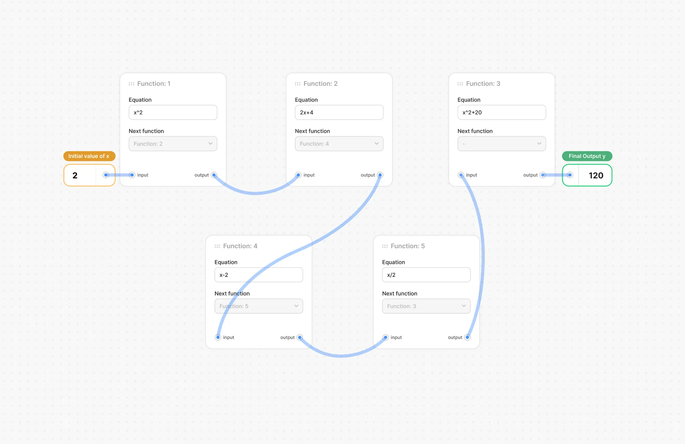

# React + TypeScript + Vite

This template provides a minimal setup to get React working in Vite with HMR and some ESLint rules.

Currently, two official plugins are available:

- [@vitejs/plugin-react](https://github.com/vitejs/vite-plugin-react/blob/main/packages/plugin-react/README.md) uses [Babel](https://babeljs.io/) for Fast Refresh
- [@vitejs/plugin-react-swc](https://github.com/vitejs/vite-plugin-react-swc) uses [SWC](https://swc.rs/) for Fast Refresh

## Expanding the ESLint configuration

If you are developing a production application, we recommend updating the configuration to enable type aware lint rules:

- Configure the top-level `parserOptions` property like this:

```js
export default tseslint.config({
  languageOptions: {
    // other options...
    parserOptions: {
      project: ['./tsconfig.node.json', './tsconfig.app.json'],
      tsconfigRootDir: import.meta.dirname,
    },
  },
})
```

- Replace `tseslint.configs.recommended` to `tseslint.configs.recommendedTypeChecked` or `tseslint.configs.strictTypeChecked`
- Optionally add `...tseslint.configs.stylisticTypeChecked`
- Install [eslint-plugin-react](https://github.com/jsx-eslint/eslint-plugin-react) and update the config:

```js
// eslint.config.js
import react from 'eslint-plugin-react'

export default tseslint.config({
  // Set the react version
  settings: { react: { version: '18.3' } },
  plugins: {
    // Add the react plugin
    react,
  },
  rules: {
    // other rules...
    // Enable its recommended rules
    ...react.configs.recommended.rules,
    ...react.configs['jsx-runtime'].rules,
  },
})
```

# Problem Statement

Develop a web application that allows users to execute a chain of 5 mathematical functions, with the output (y) of each function serving as the input (x) for the next. see the screenshot below.


[Figma](https://www.figma.com/design/7HhxIjvkW578MDkcQDZz9p/Atlys-frontend-task?node-id=1-2&node-type=frame&t=jRotqm1yNWH1Uqvk-0)

## UI: (Figma attached above)

- Display 5 cards representing 5 functions in a fixed ordered chain. use connected lines to visually represent the chaining.
- **DO NOT** use any library to build the chain/flow UI
- Replicate the UI design with pixel-perfect accuracy.
- Cards are fixed in their position. No drag-and-drop functionality required.

## Function Cards:

- Implement exactly 5 functions for this assignment.
- Each function should have a text input field for its mathematical equation. Users should be able to modify the equations.
- Functions equations should only contain basic arithmetic operations (addition, subtraction, multiplication, division) and exponents[^]. write a validator on the input to accept only these operators. (You can assume that the user will add a valid equations using the above 5 operators only).
- Design the code logic in such a way that its easy to add more functions

## Function Chaining:

- The order of function execution is fixed for this assignment. (1 → 2 → 4 → 5 → 3)
- Display a DISABLED dropdown menu for each function showing the next function in the chain. Users should not be able to change the ‘next function’.
- Visually represent the chaining of functions using connected lines (as shown in the design).

## Input and output

- Provide an input field for the initial value (x) (see design).
- Initial input is connected to function 1 (start of the chain).
- Display the final output (y) with all functions applied.
- final output is connected to function 3 (end of the chain).

## Calculation:

- Automatically calculate and update the result as users modify the equations or the initial input.

## Development:

- You are free to choose your choice of framework [React (preferred) / Vue / Svelte / Next]
- You are free to choose either JavaScript or TypeScript (highly preferred)
- You are free to choose your choice of CSS framework [TailwindCSS (preferred) / styled-components / stitches / anything else]

## After Completion:

- Deploy the app on a platform of your choice to provide a live preview.
- Push the code to a GitHub repository.
- Share the links to both the live preview and the GitHub repository.